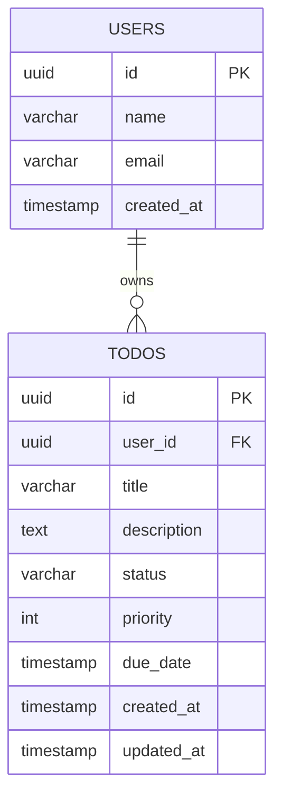

# Todo Management Application – Technical Design Document (TDD)

## 1. Overview

The Todo Management Application allows users to create, update, track, and delete todo tasks. Each user maintains their own list of todos with status tracking.

* **Tech Stack:** FastAPI, PostgreSQL
* **Capabilities:**

  * Create, update, and delete todos
  * Track status (Pending, In Progress, Completed)
  * Set due dates and priorities
  * Filter and retrieve tasks

---

## 2. System Architecture

```
Client (Web/Mobile)
        |
        v
FastAPI Web API
        |
        v
Service Layer (Business Logic)
        |
        v
Repository Layer
        |
        v
PostgreSQL Database
```

---

## 3. Data Model

### 3.1 Users Table

| Column     | Type         | Description          |
| ---------- | ------------ | -------------------- |
| id         | UUID (PK)    | Unique user ID       |
| name       | varchar(100) | User name            |
| email      | varchar(150) | Unique email         |
| created_at | timestamp    | Record creation time |

---

### 3.2 Todos Table

| Column      | Type         | Description                      |
| ----------- | ------------ | -------------------------------- |
| id          | UUID (PK)    | Todo ID                          |
| user_id     | UUID (FK)    | Owner of the todo                |
| title       | varchar(200) | Task title                       |
| description | text         | Task details                     |
| status      | varchar(20)  | Pending / InProgress / Completed |
| priority    | int          | 1=Low, 2=Medium, 3=High          |
| due_date    | timestamp    | Optional due date                |
| created_at  | timestamp    | Creation time                    |
| updated_at  | timestamp    | Last update                      |

---

## 4. ERD (Mermaid)



---

## 5. API Design

**Base URL:** `/api/v1`

### 5.1 Create Todo

* **Endpoint:** `POST /api/v1/todos`
* **Request:**

```json
{
  "title": "Prepare Architecture Document",
  "description": "Write TDD for Todo system",
  "priority": 3,
  "dueDate": "2026-03-20T00:00:00Z"
}
```

* **Response:**

```json
{
  "id": "uuid",
  "title": "Prepare Architecture Document",
  "status": "Pending",
  "priority": 3,
  "dueDate": "2026-03-20T00:00:00Z",
  "createdAt": "2026-03-09T10:00:00Z"
}
```

---

### 5.2 Get Todos

* **Endpoint:** `GET /api/v1/todos`

* **Query Params:**

  * `status` – filter by status
  * `priority` – filter by priority

* **Example:** `/api/v1/todos?status=Pending`

* **Response:**

```json
[
  {
    "id": "uuid",
    "title": "Prepare Architecture Document",
    "status": "Pending",
    "priority": 3,
    "dueDate": "2026-03-20"
  }
]
```

---

### 5.3 Get Todo By ID

* **Endpoint:** `GET /api/v1/todos/{id}`
* **Response:**

```json
{
  "id": "uuid",
  "title": "Prepare Architecture Document",
  "description": "Write TDD for Todo system",
  "status": "Pending",
  "priority": 3,
  "dueDate": "2026-03-20"
}
```

---

### 5.4 Update Todo

* **Endpoint:** `PUT /api/v1/todos/{id}`
* **Request:**

```json
{
  "title": "Prepare Architecture Document",
  "status": "InProgress",
  "priority": 3
}
```

* **Response:**

```json
{
  "message": "Todo updated successfully"
}
```

---

### 5.5 Delete Todo

* **Endpoint:** `DELETE /api/v1/todos/{id}`
* **Response:**

```json
{
  "message": "Todo deleted successfully"
}
```

---

## 6. Business Logic

* **Todo Creation**

  * Title is mandatory
  * Default status = `Pending`
  * Due date cannot be in the past

* **Todo Update**

  * Completed tasks cannot revert to Pending
  * `updated_at` updated automatically

* **Filtering**

  * Filter by status, priority, or due date

---

## 7. Validation Rules

| Field    | Rule                           |
| -------- | ------------------------------ |
| Title    | Required, max 200 chars        |
| Priority | 1–3 only                       |
| Status   | Pending, InProgress, Completed |
| DueDate  | Must be a future date          |

---

## 8. Indexing Strategy

| Table | Index          |
| ----- | -------------- |
| users | email (unique) |
| todos | user_id        |
| todos | status         |
| todos | due_date       |

---

## 9. Security Considerations

* JWT authentication
* Users can access only their own todos
* Input validation to prevent injections

---

## 10. Future Enhancements

* Task reminders
* Subtasks
* Tags for tasks
* Notifications
* Shared todos
